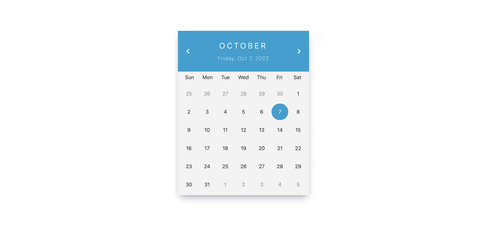

# Simple react/nextjs datepicker component that doesn't use any library

React date-picker component that doesn't use any library, created using custom hook, and few functions. Implemented in nextjs but can be used in react project.
Still needs to be tested.

[DEMO](https://next-datepicker.netlify.app/)

## Video Example

    

## Instructions:

### 1. git clone git@github.com:svilkic/next-datepicker.git

### 2. `npm install`

### 3. `npm run dev`

### 4. Change '/constants/dates.js' to other language if needed.