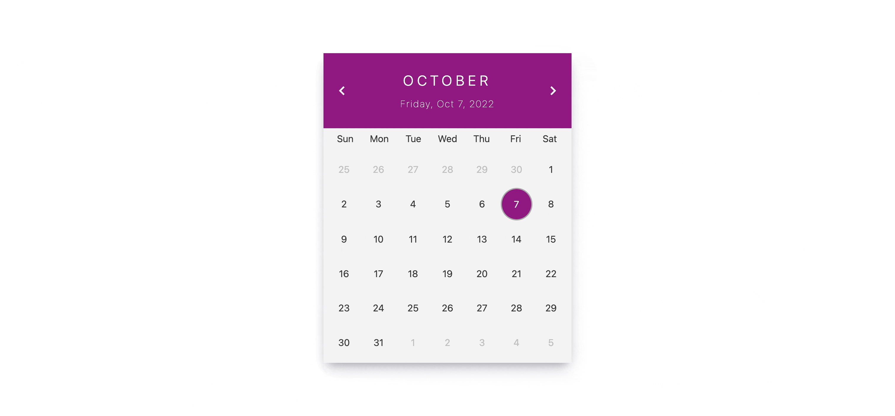

# Simple react/nextjs datepicker component that doesn't use any library

React date-picker component that doesn't use any library, created using custom hook, and few functions. Implemented in nextjs but can be used in react project.
Still needs to be tested.

[DEMO](https://next-datepicker.netlify.app/)

## Video Example

    

## Instructions:

### 1. `git clone https://github.com/svilkic/next-datepicker.git`

### 2. `npm install`

### 3. `npm run dev`

### 4. (otpional) Change `/constants/dates.js` to other language if needed.

### 5. (optional) Change primary color in `styles/globals.css`,

## TODO:

- <del>Add functionality when clcik on day of previous/next date to automaticaly switch to that month (instead of switching to next month and then chosing day)</del>
- <del>Make current date border</del>
- Make it more responsive.
- Test component fully
